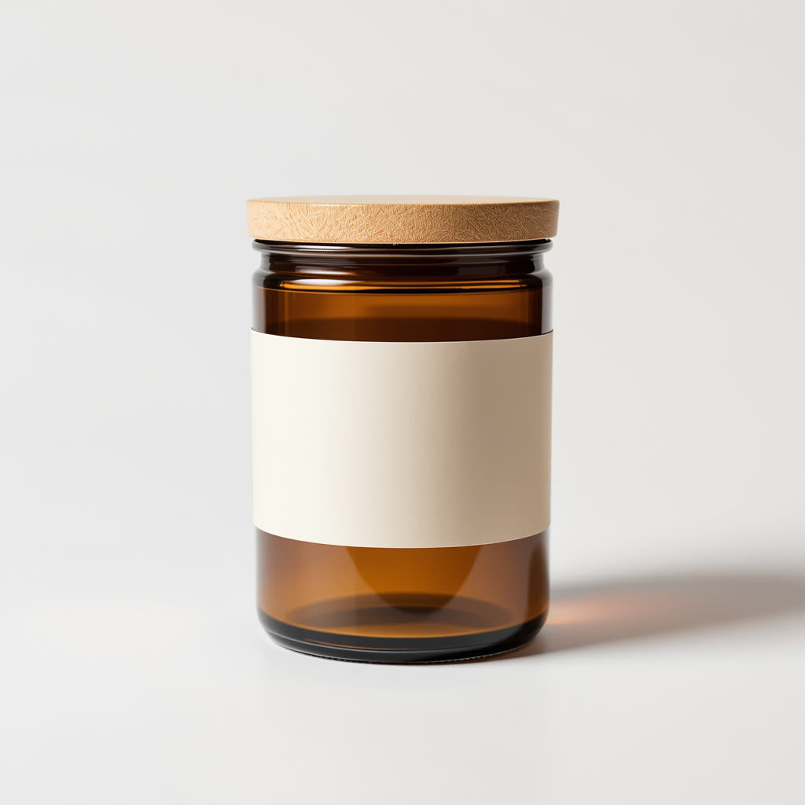

# Real runs

Both images came from this skill's Wireflow app (`skill-ai-image-generation`, Flux Pro Ultra) on 8 October 2026. The files here are downscaled copies. Full-size originals are on the Wireflow CDN.

## Lisbon bicycle (16:9)

- `prompt`: A red vintage bicycle leaning against a pastel blue tiled wall in a narrow Lisbon street, pink bougainvillea spilling over the top, late afternoon sun casting long diagonal shadows, warm golden light, shot on 35mm film, editorial travel photography
- `aspect_ratio`: `16:9`
- Output: 2752x1536 JPEG, https://cdn.wireflow.ai/ac1e2950-c2ab-11f1-81b3-8fc0dc6bd2a6.jpg
- Execution: `5cf9de29-a8c1-48ef-a0b9-b73117760776`
- Credits: 19 (account balance before minus after)

## Candle packshot (1:1)

- `prompt`: E-commerce studio packshot of an amber glass candle jar with a light oak wooden lid and a plain cream paper band label with no text, centered on a seamless pure white background, soft even studio lighting, gentle contact shadow, sharp focus, high detail product photography
- `aspect_ratio`: `1:1`
- Output: 2048x2048 JPEG, https://cdn.wireflow.ai/bae51ed0-c2ab-11f1-81b3-8fc0dc6bd2a6.jpg
- Execution: `ffbc9b69-bf66-491e-ace4-2d1e2e554e88`
- Credits: 19

This packshot is also the input photo for the product-photography skill's examples.

## How these were run

Through the Wireflow Apps API (`POST /api/v1/apps/skill-ai-image-generation/execute`), which is the same code path as the MCP `run_app` tool this skill calls. A fresh Claude session run through the MCP connector is still to be recorded.
