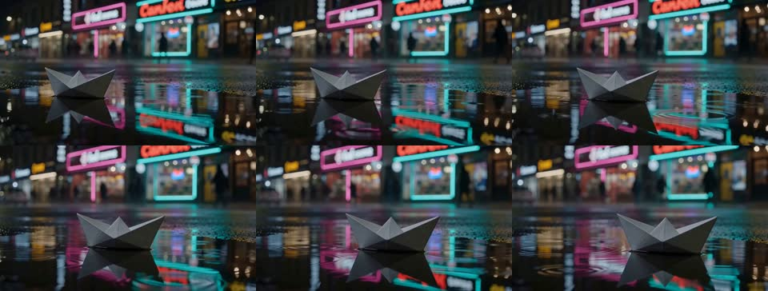

# Real run

Made by this skill's Wireflow app (`skill-ai-video-generation`, MiniMax Hailuo 03 Max Turbo, 768P, 16:9, 5 s) on 8 October 2026. The MP4 stays on the Wireflow CDN; this folder holds a poster frame and a strip of stills so the repo stays small.

## Paper boat in the rain (text to video)

- `prompt`: A small paper boat drifts across a rain puddle on a city street at night. Slow dolly-in at ground level. Neon shop signs in pink and teal reflect and ripple in the water, light rain falls, shallow depth of field, cinematic, moody
- `start_image`: not sent (text to video)
- Output: 1344x768 MP4, 5.2 s, with an audio track, https://cdn.wireflow.ai/e95405b0-c2ab-11f1-81b3-8fc0dc6bd2a6.mp4
- Execution: `b5aac5ff-1dae-4fd9-ab0a-f7528369e346`
- Credits: 40 (account balance before minus after)

## Not yet recorded

- An image-to-video run with `start_image`.
- A fresh Claude session run through the MCP connector.

This run went through the Wireflow Apps API (`POST /api/v1/apps/skill-ai-video-generation/execute`), the same code path as the MCP `run_app` tool.
