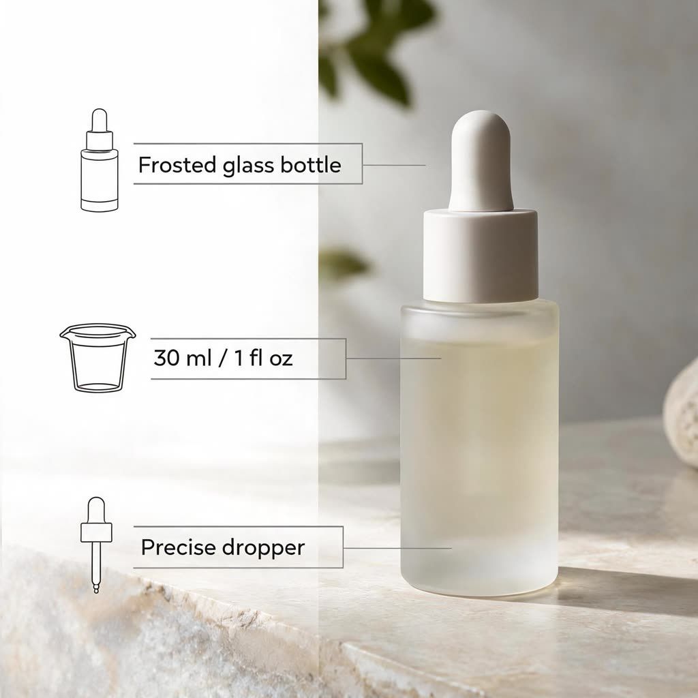

# AI Amazon Product Images for Claude Code

| Seller's photo | Slot 1: main image draft | Slot 2: feature infographic |
|---|---|---|
|  |  |  |

*Made with this skill on 8 Oct 2026: Seedream 5 Lite, 2048x2048, about 10 credits per slot. Briefs, receipts and honest notes in [examples](examples/EXAMPLES.md).*

Give Claude one real photo of your product and your real product facts. The skill plans a full listing gallery from that photo (a main image draft on white, feature infographic, lifestyle, size and scale, detail, what's in the box, how to use, comparison), writes each slot's brief with your callout text in quotes, shows the cost and waits for your yes. A Wireflow app renders each slot as a 2K square, and Claude reads back every word in the images before handing them over.

Before you use a generated image as your main image, check Amazon's current main image rules in Seller Central.

No Wireflow account? You still get the slot plan and the copy for each image, ready for a designer.

## Try it

```text
Make Amazon listing images for my serum. Photo: https://example.com/serum.jpg
Facts: frosted glass bottle, 30 ml / 1 fl oz, precise dropper. I need the
main image, an infographic and a lifestyle shot in a bathroom.
```

Also triggered by: "Amazon main image", "product infographic", "listing photos", "A+ images", "Etsy / Walmart / Shopify gallery images".

## How to install

Plugin for Claude Code (all Wireflow skills plus the Wireflow connector):

```text
/plugin marketplace add wireflowINC/skills
/plugin install wireflow-skills@wireflow
```

Then `/mcp`, pick `wireflow`, sign in.

This skill only, with the skills CLI:

```bash
npx skills add wireflowINC/skills --skill amazon-product-images
```

Or copy `skills/amazon-product-images` into `~/.claude/skills/`. Without the plugin, connect Wireflow once with `claude mcp add --transport http wireflow https://www.wireflow.ai/api/mcp` (Claude.ai and Desktop: add that URL as a custom connector). Connector guide: [Wireflow MCP docs](https://www.wireflow.ai/docs/mcp?ref=skill-amazon-product-images&utm_source=github&utm_medium=skill&utm_campaign=amazon-product-images).

## Works with

- **Claude Code**: where this skill is built to run. Install the plugin or use the skills CLI.
- **Claude.ai and Claude Desktop**: add Wireflow as a custom connector. Saving files needs a shell, so there you get the image links instead.
- **Cursor, Codex and other agents that read `SKILL.md`**: the skills CLI installs it there. Rendering needs that agent connected to the Wireflow MCP server; we have not tested those agents ourselves.

## What it costs

| Step | Credits |
|---|---|
| Slot plan, briefs, callout copy, quote | 0 |
| Each rendered slot (2048x2048) | About 10 (Wireflow list price, 8 Oct 2026; our test slots measured 10 and 13) |
| A six-slot gallery | About 60 to 78 |
| Fixing one slot | About 10, only after you approve |

Wireflow's Free plan covers building and browsing plus a first image once setup is done; rendering after that needs a paid plan, from US$24 a month.

## Rules it follows

- Callouts, dimensions and contents come from you, word for word. The skill never invents claims, ratings, awards or "best seller" badges.
- The main image slot is a draft: the product alone on white, no text, generated from your photo. It is not checked against Amazon's rules.
- Comparisons only between your own sizes or versions, never a competitor's brand.
- Check [Amazon's product image requirements](https://sellercentral.amazon.com/help/hub/reference/external/G1881) in Seller Central before you upload, above all before a generated image goes in the main image slot. The rules differ by category and they change.

## Sent and fetched

- Your product photo URL and slot briefs go to Wireflow through the Wireflow MCP connector (`run_app`), under your account. A local photo goes up through the connector's upload link.
- Finished images download from `cdn.wireflow.ai` to `./wireflow-outputs/`.
- No API keys, no scripts, no other services.

## FAQ

### Can I use the generated main image on Amazon?

Check first. Every image here is generated from your real product photo, and this skill does not check Amazon's rules for you. Read Amazon's current [product image requirements](https://sellercentral.amazon.com/help/hub/reference/external/G1881) in Seller Central before a generated image goes in the main image slot. Amazon's own [seller guide to product photos](https://sell.amazon.com/blog/product-photos) (read 8 Oct 2026) says "In most cases, product shots should be taken against a white background (RGB color values: 255, 255, 255)" and "Have the product fill 85% or more of the frame". Our test main image came out near-white rather than pure white and filled less than 85% of the frame, so treat slot 1 as a draft.

### What size are the images?

2048x2048 JPEG squares. Amazon's seller guide says all images must be "500 to 10,000 pixels on their longest side", and that every product needs at least one image, "and we recommend having at least six".

### Will the callout text be spelled correctly?

You give every word in quotes and approve it before anything renders. Claude then reads each word in the finished image against that text. In our test all three callouts were spelled exactly right. One wrong letter means a re-render, and the skill asks first.

### How much does a full set cost?

About 10 Wireflow credits per slot by list price (8 Oct 2026; our two test slots measured 10 and 13), so a six-slot gallery is about 60 to 78. The slot plan, briefs and callout copy are free.

### Do I need a Wireflow account?

Only to render. Images are made on your own Wireflow account through the Wireflow MCP connector (OAuth sign-in, no API key). Without it you still get the slot plan and the copy for each image.

## Folder

- `SKILL.md`: the procedure.
- `reference/listing-slots.md`: eight slot templates and the copy rules.
- `examples/`: the real input, outputs and briefs.

Powered by the [Wireflow AI workflow builder](https://www.wireflow.ai/ai-workflow-builder?ref=skill-amazon-product-images&utm_source=github&utm_medium=skill&utm_campaign=amazon-product-images). MIT licensed; rendering runs on Wireflow with your credits.
