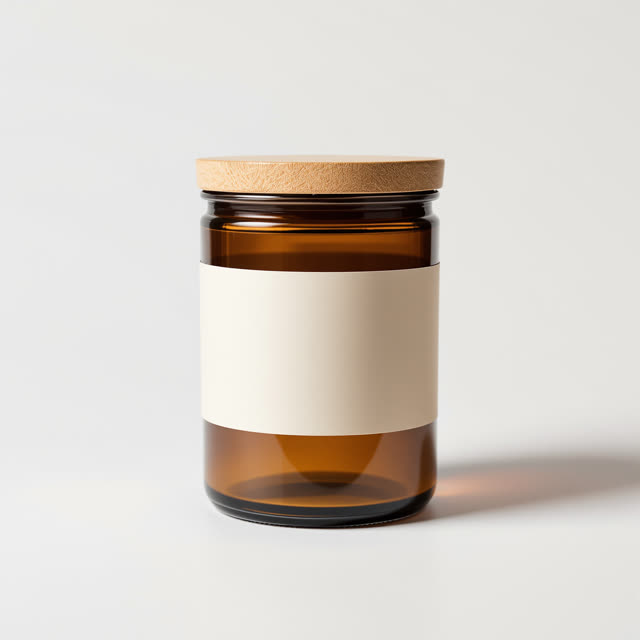
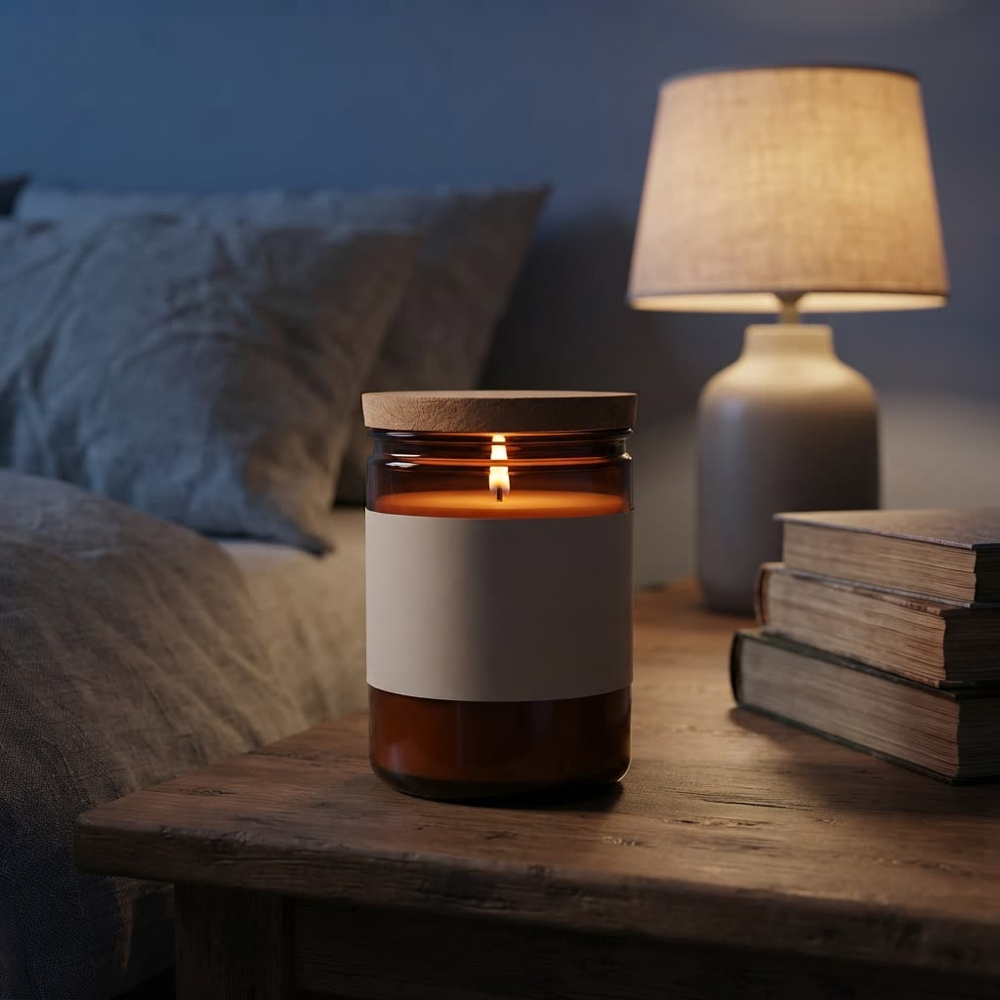

# Real runs

Made by this skill's Wireflow app (`skill-product-photography`, Nano Banana Lite) on 8 October 2026. Files here are downscaled copies; originals are on the Wireflow CDN.

## Input photo

A studio packshot of an amber candle jar. To keep the repo free of anyone else's product photos, this input was itself generated with the ai-image-generation skill: https://cdn.wireflow.ai/bae51ed0-c2ab-11f1-81b3-8fc0dc6bd2a6.jpg

## Lifestyle

- `scene`: Lifestyle: on a wooden bedside table in a calm Scandinavian bedroom at dusk, the candle lit with a small warm flame, linen bedding and a stack of books softly out of focus behind it, warm lamp light, shallow depth of field
- Output: 1024x1024 JPEG, https://cdn.wireflow.ai/gemini-07cc353c-e6b0-42ad-bd74-f49c5dd07e62.jpg
- Execution: `e8763d5b-c02b-4bb4-813e-4c2f33a598a5`
- Credits: 16
- Honest note: the model lit the candle with the lid still on. The skill now tells Claude to check physical logic like this before running.

## Flat lay

- `scene`: Flat lay seen from directly above on warm beige linen, the candle jar with its lid on, surrounded by dried eucalyptus sprigs, a few cinnamon sticks, a matchbox and a small ceramic dish, soft diffused daylight, neat balanced composition with negative space
- Output: 1024x1024 JPEG, https://cdn.wireflow.ai/gemini-30543e60-62a2-4742-b1bd-bf84c567861d.jpg
- Execution: `508edea0-f4fa-4c21-b89e-491730650247`
- Credits: 16
- Honest note: the jar is shown from the front, not from above, and the lid reads a little more like cork than in the input photo.

## How these were run

Through the Wireflow Apps API (`POST /api/v1/apps/skill-product-photography/execute`), the same code path as the MCP `run_app` tool. Both runs sent `product_photo` and `scene`. A fresh Claude session run through the MCP connector is still to be recorded.
